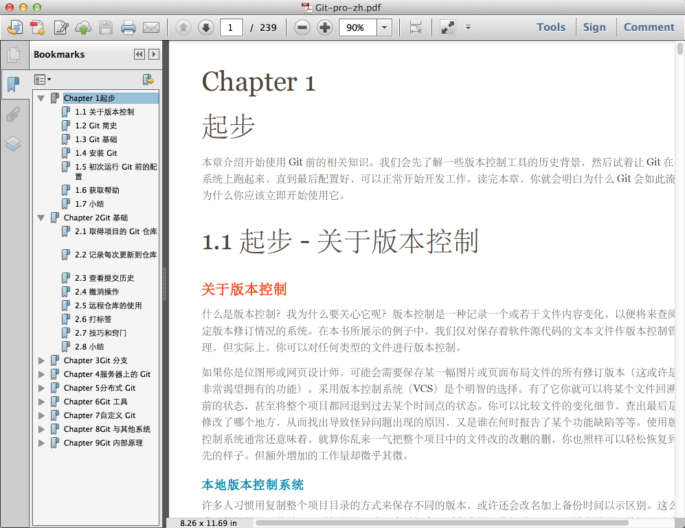

## 说明 ##

这个仓库只是作为平时练习和测试用的一些砸碎代码，包括但不限于以下的情况：

1. 学习过程中的书上的一些例子；
2. 验证某个语言某个语法的坑或者用法；
3. 测试某一个算法；

目前已存在的部分分别是：

1. [poj目录](poj)：一些在线OJ的题目；
2. [python目录](python)：一些python的练习代码；
3. [algorithm目录](algorithm)：一些算法的实现。
4. [cpp目录](cpp)：一些C++的代码实现；
5. [theCppProgrammingLanguage目录](theCppProgrammingLanguage)：该书中的代码；
6. [mysql目录](mysql)：一些SQL的练习；
7. [network目录](network): 一些网络程序的练习；
99. Git-pro-zh.pdf：本人制作的Git入门书籍一本，只是把在线的 http://git-scm.com/book/zh 弄了一个离线的版本而已；

